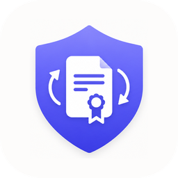
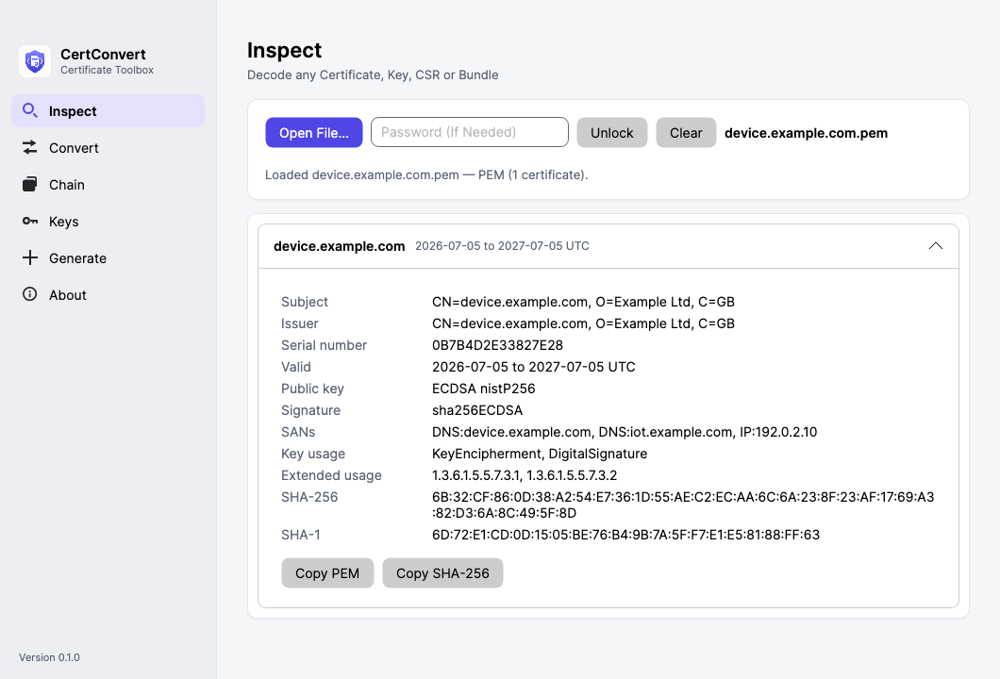

<p align="center">
  
</p>
<h1 align="center">CertConvert</h1>
<p align="center"><b>Certificate Toolbox</b> — convert, chain, inspect and generate X.509 certificates without installing OpenSSL.</p>

<p align="center">
  
  
  
  
  <a href="https://ko-fi.com/jwalkes"></a>
</p>

CertConvert is a single self-contained desktop app (and command-line tool)
that runs entirely offline. It exists for the times you need to turn a `.pem`
into a `.cer`, assemble a root → intermediate → device chain, or bundle a key
and certificate into a `.pfx`, but you're on a machine where installing
OpenSSL and running shell commands isn't an option.

<p align="center">
  <picture>
    <source media="(prefers-color-scheme: dark)" srcset="design/screenshots/inspect-dark.png">
    
  </picture>
</p>

## What it does

- **Inspect** any certificate, key, CSR or bundle — drag it in and read the
  subject, issuer, validity, SANs, key usage, fingerprints and more.
- **Convert** between PEM, DER (`.cer`/`.der`), PKCS #7 (`.p7b`) and
  PKCS #12 (`.pfx`/`.p12`), in both directions.
- **Chain** certificates: drop root, intermediate and device certs in any
  order, have them ordered automatically, validate the chain offline, then
  export it as a PEM bundle, P7B or PFX.
- **Keys**: convert private-key formats (PKCS #8, PKCS #1, SEC 1, encrypted
  or not), and check whether a key matches a certificate.
- **Generate** keys, CSRs and self-signed certificates (RSA or ECDSA), with
  SANs and CA options — the `openssl req` workflows.

Formats are detected from file *content*, not extensions, so misnamed
files — the `.cer` that's secretly PEM — just work.

## Security posture

For a tool that handles private keys, the dependency surface is the whole
story:

- **All cryptography is the .NET platform's own libraries**
  (`System.Security.Cryptography`). There is no third-party crypto code. The
  only third-party dependencies are the UI framework (Avalonia) and the MVVM
  helper (CommunityToolkit.Mvvm) — neither touches key material.
- **It never uses the network on its own.** No telemetry, no outbound
  connection of any kind. The single exception is checking GitHub for a newer
  version — which is **off by default**, and otherwise happens only when you
  click **Check For Updates** (or run `certconvert update`). Your certificates
  and keys are never uploaded anywhere, ever.
- **Private keys stay in memory.** Keys loaded from PKCS #12 files are handled
  in process and are never imported into the operating-system key store.
- **It only writes the files you ask it to** (plus one small preferences file —
  see below).

## Where things live

Almost nowhere — by design. CertConvert keeps no cache, no logs and no history.
The only files it ever creates are the ones you explicitly save, plus a single
small preferences file holding one setting (whether to check for updates on
launch — nothing sensitive):

| Platform | Preferences file |
|---|---|
| macOS | `~/Library/Application Support/CertConvert/settings.json` |
| Windows | `%APPDATA%\CertConvert\settings.json` |

Delete it any time; the app recreates it with defaults.

## Install & run

### Windows — Microsoft Store

Install from the [Microsoft Store](https://apps.microsoft.com/detail/9NT6HCG0JBFV) —
signed by the Store, updates arrive automatically.

### macOS — from a release (no .NET needed)

Grab the zip that matches your Mac from
[Releases](https://github.com/jermainewalkes/certconvert/releases) — the .NET
runtime is bundled. (A Mac App Store edition is in review.)

| Platform | File |
|---|---|
| macOS (Intel) | `CertConvert-<version>-osx-x64.zip` |
| macOS (Apple Silicon) | `CertConvert-<version>-osx-arm64.zip` |

Unzip and move `CertConvert.app` to Applications. The macOS release builds are
currently unsigned — see Troubleshooting for the one-time first-launch step.

### From source

Needs the [.NET 10 SDK](https://dotnet.microsoft.com/download/dotnet/10.0).

```bash
git clone https://github.com/jermainewalkes/certconvert.git
cd certconvert
dotnet run --project src/CertConvert    # launches the GUI
```

## Command line

The same executable is a CLI when given arguments and a GUI when not. Run it
with `--help` for the full list; a few examples:

```bash
certconvert inspect device.pem
certconvert convert device.pem -o device.cer            # PEM → DER
certconvert convert bundle.p7b -o bundle.pem            # PKCS#7 → PEM
certconvert chain build device.pem ca.pem root.pem -o chain.pfx \
            --key device.key --out-password secret
certconvert chain verify chain.p7b
certconvert key convert device.key -o device_pkcs8.key --to pkcs8
certconvert key match --cert device.pem --key device.key
certconvert gen selfsigned --new-key p256 --key-out dev.key \
            --cn device.local --dns device.local -o dev.pem
certconvert update                                      # check GitHub for a newer version
certconvert update --install                            # download, verify and apply it
```

Exit codes: `0` success, `1` usage error, `2` failure (including an invalid
chain or a key that does not match).

## Troubleshooting

- **macOS: "CertConvert can't be opened"** — the build is unsigned;
  right-click the app → **Open** (one-time), or allow it under
  System Settings → Privacy & Security.
- **Windows: "Windows protected your PC"** — only applies to self-compiled
  builds (SmartScreen on an unsigned binary; **More info → Run anyway**,
  one-time). The Microsoft Store edition is signed and shows no warning.
- **"…is password-protected"** — the file is an encrypted PFX or key; type
  the password in the password field and use Unlock (GUI) or `--password`
  (CLI). Errors always name the file that needs it.
- **Windows CLI output interleaves with the prompt** — the exe is a GUI
  program attaching to your console; press Enter to get the prompt back.
- **Which build am I running?** — `certconvert --version` prints the version
  plus the exact git commit it was built from.
- **Update didn't apply / partially applied** — download the latest zip from
  [Releases](https://github.com/jermainewalkes/certconvert/releases) and replace
  the app manually. If a self-update was interrupted, a recovery copy of the
  previous version is kept beside the app (`CertConvert.app.bak` on macOS,
  `CertConvert.exe.old` on Windows) until the next launch.
- **"Check For Updates" can't reach GitHub** — that check needs internet; on an
  offline machine it simply reports the failure and changes nothing. Everything
  else works offline.

## Development

```
src/CertConvert.Core/   all certificate/key logic — no UI dependencies
src/CertConvert/        Avalonia GUI + CLI (Cli/) in one executable
tests/                  Core unit tests (incl. OpenSSL interop fixtures)
                        and headless Avalonia UI tests
build/                  publish scripts, icon generation, dev-run helper
```

```bash
dotnet test                   # full suite
./build-in-docker.sh          # same suites + Release build in Docker — no host SDK needed
build/publish.sh              # self-contained builds: osx-x64, osx-arm64, win-x64
build/run-dev-app.sh          # macOS: run the Debug build as a bundled .app
```

The release process is documented in [build/RELEASING.md](build/RELEASING.md).

## Accessibility

Accessibility is a launch requirement, not an afterthought. Every control is
reachable by keyboard, icon-only and ambiguous controls carry screen-reader
labels, and operation results are announced through live regions. If anything
is awkward with assistive technology, please raise an issue — accessibility
problems are treated as bugs.

## Support

CertConvert is free and open source under the [MIT licence](LICENSE). If it
saves you time, you can [buy me a coffee on Ko-fi](https://ko-fi.com/jwalkes) ☕

## Roadmap

Signed and notarised macOS builds, a Windows installer, automated release
builds, signing CSRs with your own CA, and a universal macOS binary.
